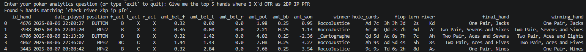

# Poker Analytics Copilot

A data analyst that helps me analyze my game and filter my hands to isolate possible leaks.

# Am I checking too many pocket pairs on the river as 2BP IP PFR?

# Architecture

User → LLM → Parser → Router → Tool → Pandas → Result

Parser provides specific instructions about how to deal with user's requests and the correct LLM output needed. It also prevents undesired results that could break the code on later stages of the data flow.

Router allows me to use the right tool according to LLM output. At the same time, it prevents the code from breaking in case the LLM output contains an unknown query by raising a ValueError.

# Design decisions
* Config driven registries instead of if/elif for simplification and scalability.
* Separated hand-filtering from hand-display, so new filters reuse the same detail view.
* Refactor of analyze metrics after observing same data pipeline (generate columns → aggregate results → derive new columns).
* Parameterized queries to prevent SQL injection.

# What it's not
* A strategy advisor for how to play poker.
* A hand history parser as it uses PT4's already parsed database.

# Stack
* Python
* Pandas
* PostgreSQL
* SQLAlchemy
* OpenAI API
